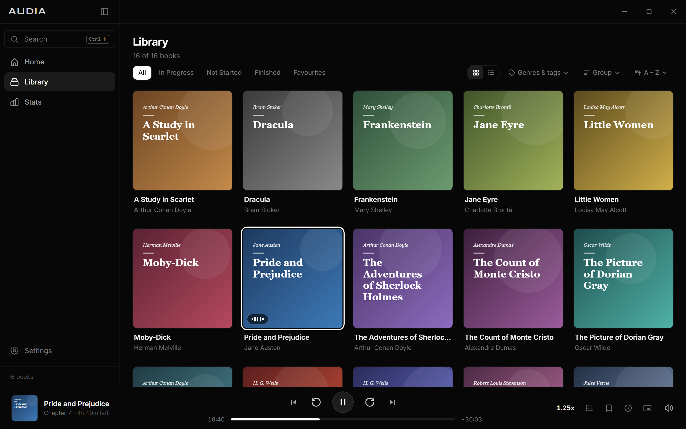
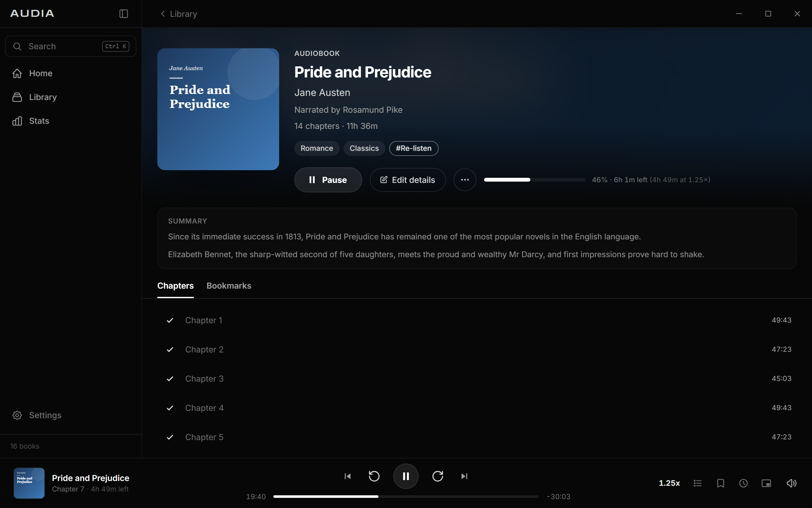
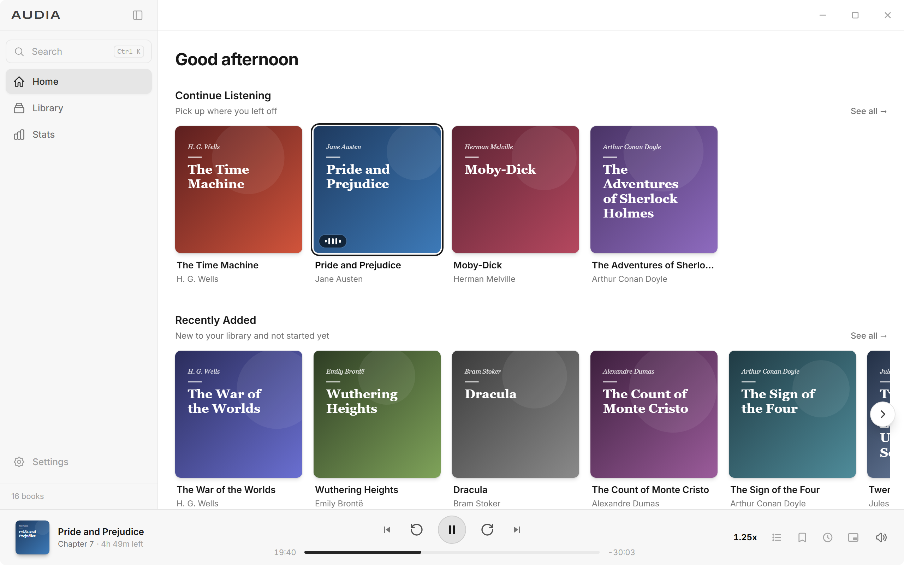
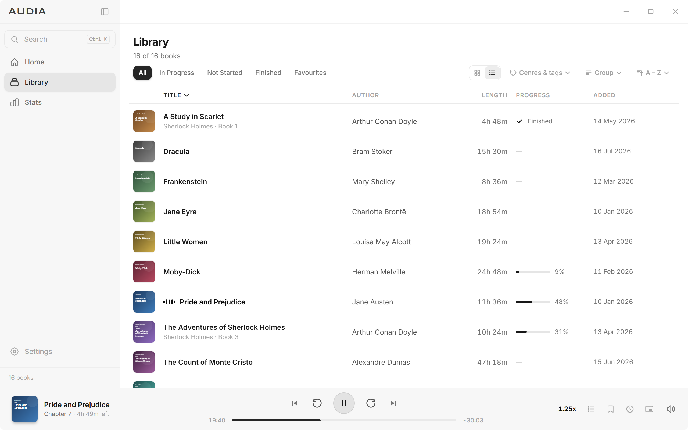

# Audia

An offline audiobook player for your own library. Point it at the folder where you keep your audiobooks and Audia organises them, remembers your place in every book, and stays out of the way while you listen.



## Download

Get the latest Windows installer (`Audia_…_x64-setup.exe`) from the [Releases page](https://github.com/etherloper/audia/releases/latest). Once installed, Audia checks for new versions itself and offers to update; you can turn that off or check by hand in **Settings → About**.

The installer isn't code-signed yet, so Windows SmartScreen may warn you the first time. Choose **More info → Run anyway**.

## Features

**Library**
- Watches your audiobook folder and picks up new books automatically. Drag books onto the window to copy them in.
- Grid or list view, with filters (in progress, not started, finished, favourites), sorting, and grouping by author, series or genre.
- Genres read from your files, plus your own tags.
- Quick search (Ctrl+K) across books, authors, series, genres, tags and bookmark notes.
- Covers and chapters read from the files themselves, including the chapter markers inside .m4b and other single-file books.
- Edit any book's details. "Find online" offers covers and descriptions from Open Library and Google Books to choose from.

**Listening**
- Every book remembers its position, chapter and speed.
- Speed from 0.5× to 3×, adjustable skip lengths, and a short rewind when you resume after a pause.
- Bookmarks with notes, exportable as Markdown.
- Sleep timer, including "end of chapter".
- Voice boost to make quiet narration easier to hear.
- Finished chapters are ticked off as you go.

**Around the desktop**
- Mini player that snaps to a corner of the screen and can stay on top.
- Media keys and the Windows media overlay.
- Closes to the system tray if you want it to.
- Listening history and stats.
- Light and dark themes with a choice of accent colours.
- Backup and restore of your progress, bookmarks and edits.

## Screenshots

**A book's page**, with its chapters, progress, genres and tags



**Home**, in the light theme



**The library as a list**, sortable by any column



*Screenshots use a sample library of public-domain classics with placeholder covers.*

## Supported formats

MP3, M4A, M4B, MP4, AAC, OGG, Opus, FLAC and WAV.

A book can be a folder of audio files (one per chapter, ordered by track number then file name) or a single file. Single files with embedded chapter markers are split into their chapters.

## Privacy

Audia works entirely offline. The only time it goes online is when you click **Find online** (for one book) or **Find missing covers & descriptions** (in Settings). Those send a book's title and author to Open Library and Google Books to look up covers and descriptions. Nothing else leaves your computer.

## Keyboard shortcuts

| Keys | Action |
|---|---|
| Space | Play / pause |
| ← / → | Skip back / forward |
| Shift + ← / → | Previous / next chapter |
| [ / ] | Slower / faster |
| ↑ / ↓ | Volume |
| M | Mute |
| B | Add bookmark |
| Ctrl + Shift + M | Mini player |
| Ctrl + K | Quick search |

## Building from source

Audia is built with [Tauri 2](https://tauri.app), [Svelte 5](https://svelte.dev) and Rust. It's developed and tested on Windows.

### Prerequisites

- [Bun](https://bun.sh)
- [Rust](https://rustup.rs) 1.90 or newer
- The Tauri prerequisites for your platform: see [Tauri's guide](https://tauri.app/start/prerequisites/). On Windows that's the Microsoft C++ Build Tools and WebView2, which Windows 10 and 11 already include.

### Commands

```bash
bun install          # install JavaScript dependencies
bun tauri dev        # run the app in development mode
bun tauri build      # build installers into src-tauri/target/release/bundle
```

### Tests and checks

```bash
bun run test         # JavaScript unit tests (Vitest)
bun run check        # Svelte and TypeScript type check
cd src-tauri
cargo test           # Rust tests
cargo clippy         # Rust lints
cargo fmt --check    # Rust formatting
```

## Releasing

Releases are built by GitHub Actions (`.github/workflows/release.yml`) when a version tag is pushed:

1. Bump the version in `src-tauri/tauri.conf.json`, `src-tauri/Cargo.toml` and `package.json`, and commit.
2. Tag and push: `git tag v0.2.0` then `git push origin v0.2.0`. The tag must match the version.
3. The workflow runs the checks, builds the installer and the signed update files, and creates a **draft** release. Review it on GitHub and publish it; installed copies only see published releases.

Updates are signed. The workflow needs two repository secrets, `TAURI_SIGNING_PRIVATE_KEY` and `TAURI_SIGNING_PRIVATE_KEY_PASSWORD`, from a key made with `bun tauri signer generate`. The matching public key is in `tauri.conf.json`. Keep the private key out of the repository and backed up: without it, existing installs can't be sent updates.

## Where your data lives

Your library database, cover images, settings and logs are stored in your user profile under `com.audia.app` (on Windows, `%APPDATA%\com.audia.app` and `%LOCALAPPDATA%\com.audia.app`). Your audio files are never modified. Uninstalling Audia leaves your data in place unless you choose to remove it.

## License

[MIT](LICENSE)
